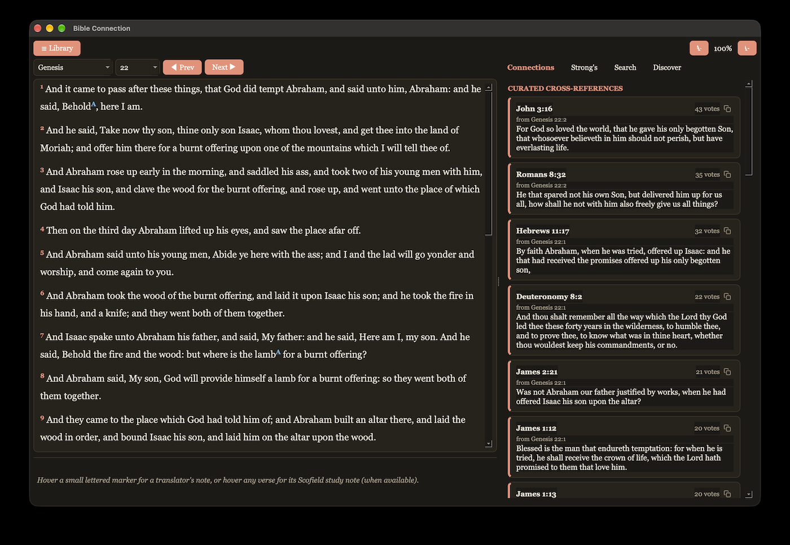

# Bible Connection



A KJV Bible reader that shows you how verses connect to each other as
you read — cross-references, machine-learning-matched similar passages,
red-letter text, the King James translators' own footnotes, a 1917
study Bible's notes, and a built-in Strong's concordance for the
original Hebrew and Greek words — all without leaving the page you're
on.

## Getting started

There's no server to start, no browser to open, and nothing to connect
to — the Bible text and every connection between verses come built
into the app. You need Python 3.10 or newer, on macOS, Windows or Linux.

### Install with pipx (recommended)

[pipx](https://pipx.pypa.io) installs Bible Connection with everything
it needs, keeps it separate from anything else on your computer, and
gives you a `bible-connection` command to start it. First get pipx
itself, once:

- **macOS:** `brew install pipx` (with [Homebrew](https://brew.sh)),
  then `pipx ensurepath`
- **Windows:** `py -m pip install --user pipx`, then `py -m pipx ensurepath`
- **Linux:** your distribution's `pipx` package (e.g.
  `sudo apt install pipx`), then `pipx ensurepath`

Then open a new Terminal (or Command Prompt) window and run:

```bash
pipx install https://github.com/MrChillStorm/Bible_Connection/archive/main.zip
bible-connection
```

The install downloads a few hundred megabytes — the Bible library
itself, and the toolkit that draws the window — and takes a few
minutes the first time. The very first launch then spends a moment
setting up the library. Later:

```bash
pipx upgrade bible-connection     # get the latest version
pipx uninstall bible-connection   # remove it (your reading history stays)
```

### From a download (macOS)

If you'd rather not install anything beyond Python itself, download
this project (the green **Code** button → **Download ZIP**, then
unzip it), and:

**Step 1 — one time only.** Open **Terminal** (Applications → Utilities
→ Terminal), type `cd ` (with a space after it, don't press Return
yet), then drag the `Bible_Connection` folder from Finder into the
Terminal window — that fills in the correct path for you. Press
Return, then paste this and press Return again:

```bash
pip3 install -r requirements.txt
```

This installs the two code libraries the app needs (the toolkit that
draws the window, and a small helper that finds the right folder for
your reading history). If it answers that the environment is
"externally managed" — Homebrew's Python does that — use pipx above
instead.

**Step 2 — every time you want to read.** Double-click **Bible
Connection** (the app icon) in this folder. A window opens; that's
the app. The app has to stay in this folder, since it starts the code
next to it.

(If macOS says it can't verify the app the first time, right-click it
→ Open, then click Open again in the dialog that appears. That's a
standard one-time confirmation for any app that didn't come from the
App Store — not a sign anything's wrong.)

**If double-clicking doesn't open anything**, the packages from Step 1
probably aren't installed yet — the app will tell you this in a dialog
and open Terminal for you. Just run the `pip3 install` command from
Step 1 again there — it's safe to run more than once.

### From a download (Windows and Linux)

In a Command Prompt or terminal inside the downloaded folder, once:

```bash
python -m pip install -r requirements.txt
```

and then, every time you want to read:

```bash
python -m bible_connection
```

(On Windows, `py` works in place of `python`.) Bible Connection is
built and tested on macOS; it's plain Qt, so Windows and Linux should
work the same, but haven't been tried — if anything behaves
differently than described here, that's worth reporting.

## What you can do in the app

**Library.** Opens to every book of the Bible, Old and New Testament
side by side, grouped the traditional way (Law, History, Wisdom &
Poetry, Major/Minor Prophets; Gospels, Acts, Paul's Letters, General
Letters, Revelation). Check a book off once you've read it — it gets a
line through it as a reminder; this doesn't affect your reading
position. Click any book to open it.

**The reader.** It remembers exactly where you stopped in *every* book
— come back days later and it opens right where you left off. Prev/Next
moves a chapter at a time, crossing from one book into the next at the
edges.

Jesus's own words render in red; if a verse mixes narration with
something He said, only the actual words He spoke turn red.

Some verses have small markers, or respond to hovering:
- Small lettered markers (A, B, …) are the King James translators' own
  footnotes — mostly literal Hebrew/Greek renderings of a specific
  word or phrase. Hover one to read it in the bar under the text.
- Hovering anywhere on a verse — no marker needed — shows a study note
  from the 1917 Scofield Reference Bible, if that verse has one. These
  are usually about the whole verse rather than one word, which is why
  they don't need a marker of their own; a footnote's marker takes
  priority if you're hovering it specifically.

**Connections tab.** Updates live as you scroll to show verses
connected to whatever's currently on screen — both connections people
have drawn between passages for centuries, and ones a machine-learning
model finds by comparing what verses *mean*, not just which words they
share. Click
one to jump there. Hover one first and the reading pane briefly scrolls
to show exactly which verse it connects from, snapping back once you
move your mouse away.

**Strong's tab.** Every original Hebrew or Greek word behind the
English text currently on screen, with its meaning. Hover one to
highlight everywhere it's used in the text. Click one for its full
dictionary entry plus every verse in the whole Bible that uses that
exact original word — a built-in concordance. The search box at the
top isn't limited to what's currently on screen — type a number
("G26", "H430") or a word ("agape", "love") to jump straight to any
entry in the whole concordance.

**Search tab.** Look up a specific verse ("John 3:16"), or search for a
word or phrase across the whole Bible.

**Discover tab.** A browsable feed of connections a machine-learning
model found on its own, with no traditional cross-reference behind
them — a place to find something you weren't already reading toward,
rather than a reaction
to whatever's currently on screen. Click "Shuffle" for a new set, or
click either verse in a pair to jump to it. Right-click a verse here to
copy it (this list can hold thousands of results, so it skips the
per-row copy button the other tabs have, in favor of scrolling that
stays instant).

**Getting back to where you were.** Click any connection, search
result, word occurrence, or Discover result and you'll jump there. A
"← Back to reading" button appears next to the Library button — click
it any time to return to exactly where you were, no matter how many
things you clicked along the way.

**Copy button.** Every listed verse or word has a small copy icon —
click it to copy that reference and text to your clipboard (see the
Discover tab above for the one exception).

**Light and dark mode.** The app automatically matches whatever your
computer is set to.

**Text size.** The "A-" / "A+" buttons above the reading pane make
every bit of text in the app — the Bible text, cards, buttons, tab
labels, everything — a little smaller or larger at once. It remembers
your choice for next time.

## Your reading history

Where you stopped in every book, the books you've checked off and your
text size are kept in one small file, `user_state.db`, next to the
app's Bible library (`bible.db`), in your system's usual place for app
data:

| System | Folder |
|---|---|
| macOS | `~/Library/Application Support/Bible Connection` |
| Windows | `C:\Users\<you>\AppData\Local\Bible Connection` |
| Linux | `~/.local/share/Bible Connection` (or `$XDG_DATA_HOME/Bible Connection`) |

That's outside the app itself, so updating, reinstalling or moving the
app never touches your reading history. After an update that brings a
new version of the Bible library, the app sets it up again on the next
launch, the same way as the first time.

## Bonus: Ezekiel's Temple in 3D

[](https://mrchillstorm.github.io/Bible_Connection/extras/ezekiel-temple.html)

A separate, self-contained interactive model of the temple vision in
Ezekiel 40–42 (plus the sanctuary from ch. 41, the altar from ch. 43,
and the river from ch. 47) — built to the cubit measurements the text
actually gives, with citations for every structure and honest notes on
the handful of places the text leaves a height or a footprint
unstated. Drag to orbit, scroll to zoom, tap any structure for its
measurement and verse. Click the picture above to open it live in your
browser — or, if you've downloaded this folder, double-click
`extras/ezekiel-temple.html` directly; no server or install needed
either way.

## Want to know how it's built, or change something?

See [DEVELOPMENT.md](DEVELOPMENT.md) — the data pipeline, database
schema, how the machine-learning connections are computed, how to
extend it, and the tests.
